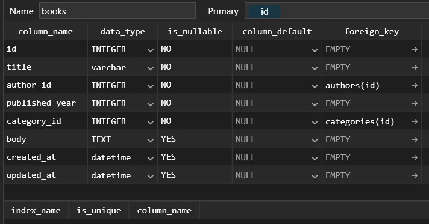
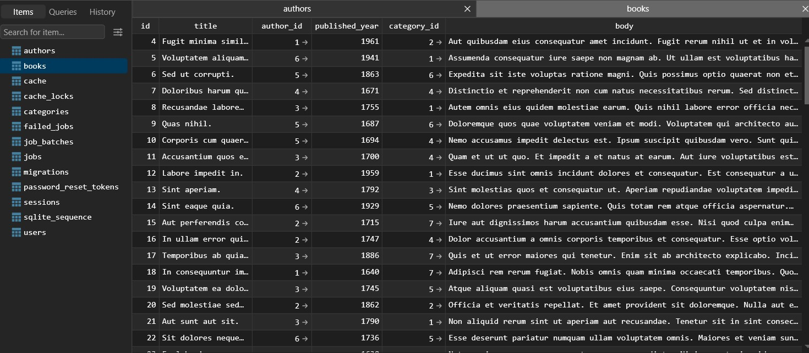
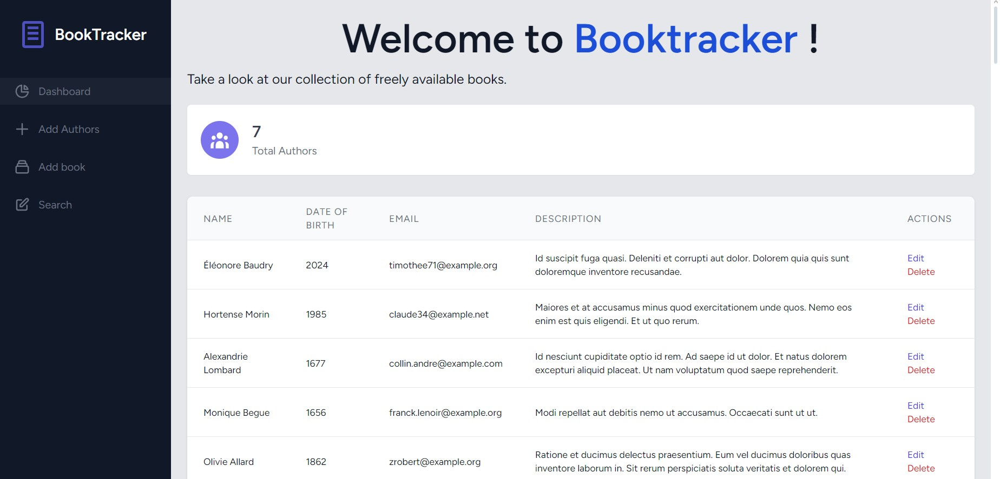

# Laravel CRUD Project - BookTracker

<p align="center">
    
</p>

Welcome to the GitHub repository of the final project of Ariel CHAMBAZ and Victor LEQUEUX AUDRAN made for the Framework based programming course 2024 at ITS ! This project was created to manage Books, Authors, and Categories. It features functionality to create, edit, delete, and view authors and books, with category management, and exception handling.

Link to the video presentation:
https://www.youtube.com/watch?v=J5luD0f5RhY

## Requirements

- `PHP 8.2`
- `Composer`
- `Node.js` and `npm`
- `Tailwind` dependencies

## Installation

1. Clone the repository:
    ```sh
    git git@github.com:ArielChambaz/BookTracker.git
    cd cd BookTracker/bookTracker/
    ```

2. Install PHP dependencies:
    ```sh
    composer install
    ```

3. Install JavaScript dependencies:
    ```sh
    npm install
    ```

4. Copy the [`.env.example`](.env.example) file to a new `.env` file and configure your environment variables:
    ```sh
    cp .env.example .env
    ```

5. Generate the application key:
    ```sh
    php artisan key:generate
    ```

## Development Scripts

- To start the development server:
    ```sh
    php artisan serve
    ```

- To compile assets:
    ```sh
    npm run dev
    ```

## Project Features

- **CRUD Operations** for Books and Authors
- **Category Management** for Books
- **View content** of a single book
- **Exception Handling** for example when trying to delete an author linked to books it notify the user that it's not possible  
- **Basic Blade Layout** with TailwindCSS for a responsive design

## Database Structure

The project uses three tables:

- **Authors**: Stores author details. We wanted to personalize the names so that they sounded french. The PHP library `Fake` allows us to do that by modifying the value of the `APP_FAKER_LOCALE`variable to `fr_FR` in the `.env` file.
- **Books**: Stores book details including title, author, category, and description.
- **Categories**: Categorizes books with predefined categories.

Here is a sample of the code written in `2024_10_06_043145_create_books_table.php` (the migration file of our `Books table`) : 
```php
public function up(): void
    {
        Schema::create('books', function (Blueprint $table) {
            $table->id();
            $table->string('title');
            $table->foreignId('author_id')->constrained('authors');
            $table->integer('published_year');
            $table->foreignId('category_id')->constrained('categories');
            $table->text('body')->nullable();
            $table->timestamps();
        });
    }
```

## Models and Relationships

- **Book** belongs to an **Author** and a **Category**.
- **Author** can have many **Books**.
- **Category** can be assigned to many **Books**.

Here is the structure of the `Books table` visualized in `TablePlus` we can see that there are 2 foreign key, one to fetch the author from the `Authors table` and one to fetch the category from the `Categories table`  : 

<p align="center">
    
</p>

Here are the relationships defined in the models `Book.php`, `Author.php`, and `Category.php`:

```php
// In Book.php
public function author(): BelongsTo {
    return $this->belongsTo(Author::class);
}
public function category(): BelongsTo {
    return $this->belongsTo(Category::class);
}

// In Author.php
public function books(): HasMany {
    return $this->hasMany(Book::class);
}

// In Category.php
public function books(): HasMany {
    return $this->hasMany(Book::class);
}
```

## Book, Category and Authors factories and seeders

To automatically fill the tables in our database, we created new factories `BookFactory.php`, `AuthorFactory.php` and `CategoryFactory.php`. Here is a screenshot of the dummy data in the `Books table` in TablePlus:

<p align="center">
    
</p>

Here is the code of `BookFactory.php`. As you can see we tried to mimic real books by generating long paragraph with spaces between them : 
```php
public function definition(): array
    {
        return [
            'title' => $this->faker->sentence(rand(2, 5)),
            'author_id' => Author::factory(),
            'category_id' => Category::inRandomOrder()->first()->id, // Assign a random category 
            'body' => implode("<br><br>", array_map(function() {
                return fake()->text(500); // Generates a longer text (300 characters).
                }, range(1, rand(5, 9))) // Generates between 3 to 5 paragraphs.
            ),
            'published_year' =>$this->faker->dateTimeBetween('-400 years', '-5 years')->format('Y'),
        ];
    }
```

To avoid having to manually activate our factories by typing commands into `Tinker` for each new fresh migration, we created seeders to automatically populate our tables with the `php artisan migrate:fresh --seed` command. Here is what we wrote in each seeder : 
```php
// In AuthorSeeder.php
public function run(): void{
    Author::factory(6)->create(); //create 6 random authors using the linked factory 
}

// In CategorySeeder.php
public function run(): void{
    Category::factory(7)->create(); //create 7 category from the list given in the linked factory
}

public function run(): void{
        $this->call([CategorySeeder::class,AuthorSeeder::class]);
        Book::factory(100)->recycle([ //create 100 books and assign to them a category and an author already created by the 2 previous seeders. 
            Category::all(),
            Author::all(),
        ])->create();
    }
```

## User Interface

The UI uses TailwindCSS for styling and includes a responsive layout for better user experience. Here’s the dashboard / homepage of our website :

<p align="center">
    
</p>

Buttons for actions (add author, add book, search) change color on hover to improve usability

**START EDITING FROM HERE**

## Book Management

You can create, edit, and delete books. Each book belongs to an author and a category.

<p align="center">
    
</p>

You can view the details of a single book by clicking its title. The view displays the book's title, author, category, and content.

<p align="center">
    
</p>

Example Blade view code (file: `resources\views\books\show.blade.php`):


## Exception Management

The project includes exception handling to prevent users from deleting an author with associated books or creating a new user with an already taken email address.

<p align="center">
    
</p>

Here is a sample of the code for exception handling in case of author conflict (file: `app\Http\Controllers\AuthorController.php`):

```php
public function destroy(Author $author)
    {
        try {
            // Verify if author is linked to books 
            if ($author->books()->count() > 0) {
                return redirect()->route('dashboard.index')->with('error', 'Cannot delete author with associated books.');
            }

            $author->delete();
            return redirect()->route('dashboard.index')->with('success', 'Author deleted successfully.');
        } catch (Exception $e) {
            Log::error('Error deleting author: ' . $e->getMessage());
            return redirect()->route('dashboard.index')->with('error', 'An error occurred while deleting the author.');
        }
    }
```
